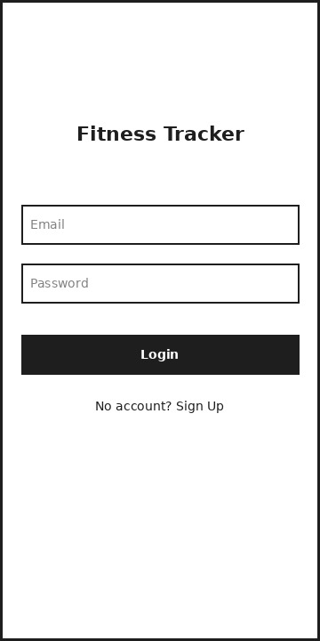
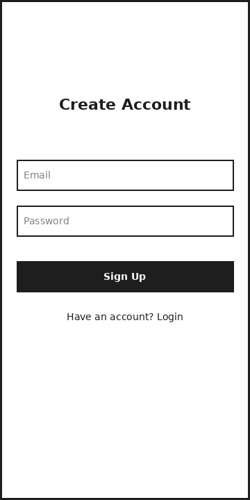
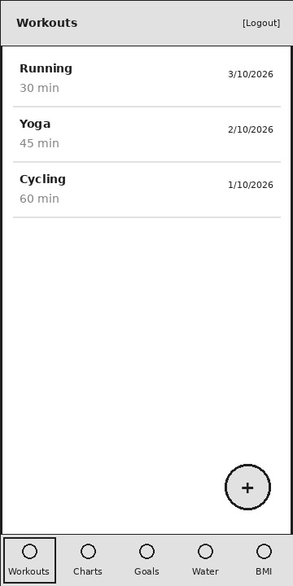
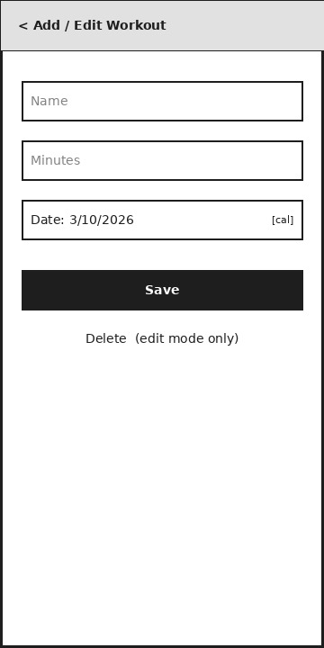
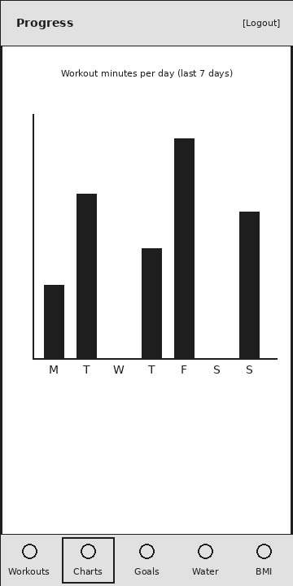
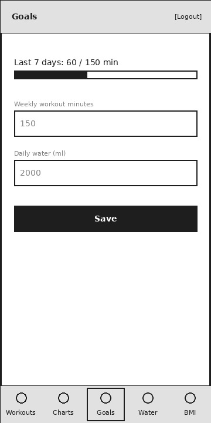
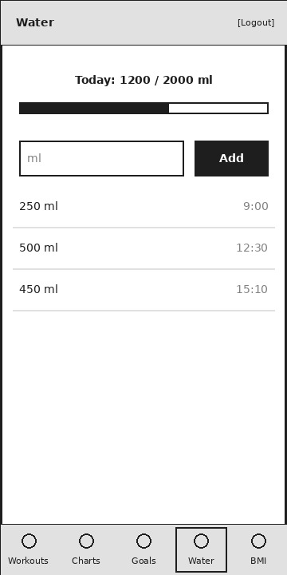
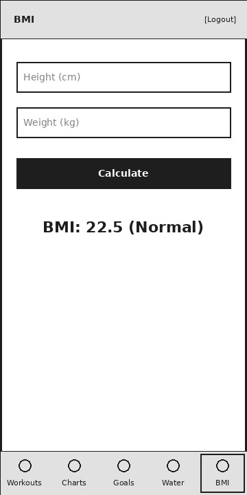

# Wireframes

## Screens
1. Login: 
2. Sign Up: 
3. Workout List: 
4. Add/Edit Workout: 
5. Progress Charts:  
6. Goals:  
7. Water Tracker:  
8. BMI Calculator:  

## Navigation Flow
- App opens and checks if a user is logged in.
    - Logged in: Workout List.
    - Not logged in: Login.
- Login and Sign Up link to each other.
- Login or Sign Up success: Workout List.
- Bottom bar switches between: Workouts, Charts, Goals, Water, BMI.
- Workout List: add button or tap a workout > Add/Edit Workout > Save or Delete > back to Workout List.
- Logout (top bar) > Login.
- Login, Sign Up and Add/Edit Workout have no bottom bar.

## UI Components
- Text input fields
- Buttons (Login, Sign Up, Save, Delete, Add, Calculate)
- Top bar with Logout button
- Bottom navigation bar (5 tabs)
- List with items (workouts, water entries)
- Floating add button (Workout List)
- Date picker (Add/Edit Workout)
- Bar chart
- Progress bars (Goals, Water)
- Text for results and totals (BMI, water total)
- Loading indicator and error message popup (login and save errors)