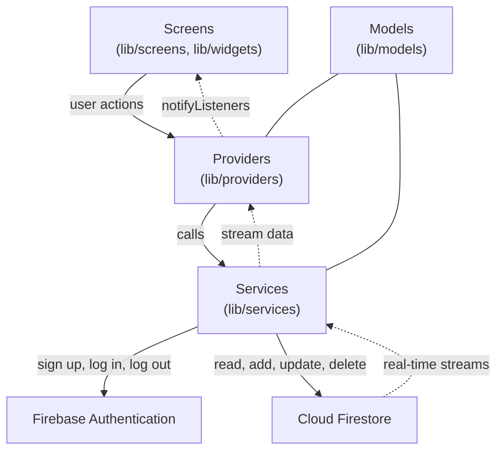
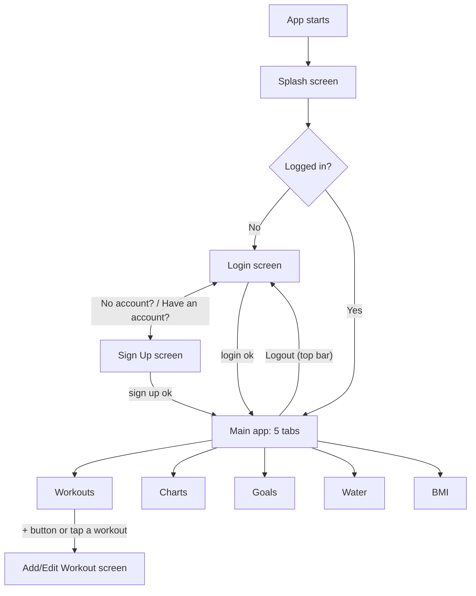

# Fitness Tracker

A Flutter app with a Firebase backend. A user signs up, logs workouts, sees a 7-day progress chart, sets goals, tracks daily water intake and calculates BMI. Each user sees only their own data.

Built individually by Razi Ibrahim (GitHub: RazibrahimRI) as part of the Linkific Flutter internship.

## Table of Contents

1. [Features](#features)
2. [Screenshots](#screenshots)
3. [Tech Stack](#tech-stack)
4. [Architecture](#architecture)
5. [Setup Instructions](#setup-instructions)
6. [Running and Building](#running-and-building)
7. [API Documentation](#api-documentation)
8. [Input Rules](#input-rules)
9. [Project Structure](#project-structure)
10. [Known Limits](#known-limits)

## Features

| # | Feature | What it does |
|---|---|---|
| 1 | User authentication | Sign up, log in and log out with email and password. A logged-in user skips the Login screen when the app reopens |
| 2 | Workout logging | Add, view, edit and delete a workout (name, minutes, date) |
| 3 | Progress charts | Bar chart of workout minutes per day for the last 7 days, with an empty-state message when there are no workouts |
| 4 | Goal setting | Set a weekly workout minutes goal and a daily water goal, and see progress against them |
| 5 | BMI calculator | Enter height and weight to see the BMI and its category. Not saved |
| 6 | Water intake tracker | Add water in ml, delete an entry, and see today's total against the daily goal |
| 7 | Data persistence | Workouts, water entries and goals are saved in Cloud Firestore for each user and are still there after restarting the app |

Also included: loading spinners while data loads or saves, and error messages when a load or save fails.

## Screenshots

| Login | Sign Up | Workout List |
|---|---|---|
|  |  |  |

| Add/Edit Workout | Progress Charts | Goals |
|---|---|---|
|  |  |  |

| Water Tracker | BMI Calculator |
|---|---|
|  |  |

## Tech Stack

| Technology | Used for |
|---|---|
| Flutter (Dart) | The mobile app |
| Firebase Authentication | Email and password accounts |
| Cloud Firestore | Saving data and live updates |
| `provider` | State management |
| `fl_chart` | Progress charts |
| `firebase_core` | Connecting the app to Firebase |

The app has no server of its own. It talks to Firebase directly through the Firebase SDKs.

## Architecture

The code is grouped by type inside `lib/`. Each layer has one job:

* **Screens** show data and send button taps to the providers
* **Providers** hold the data, the loading flag and the error message, and tell the screens when something changes
* **Services** are the only code that talks to Firebase
* **Firebase** stores the data and sends live updates back



### App flow



`AuthGate` in `main.dart` decides which screen to show, so a logged-out user cannot reach any app screen.

## Setup Instructions

### What you need

* [Flutter SDK](https://docs.flutter.dev/get-started/install)
* Android Studio (with an Android emulator) or a real Android phone
* A Google account for Firebase

### Steps

1. **Clone the repository**

   ```bash
   git clone https://github.com/RazibrahimRI/Linkific_Tasks.git
   cd Linkific_Tasks/"Day 29"/fitness_tracker
   ```

2. **Check Flutter works**

   ```bash
   flutter doctor
   ```

3. **Create a Firebase project** at the [Firebase console](https://console.firebase.google.com).

4. **Turn on Email/Password sign-in:** Build, then Authentication, then Sign-in method, then Email/Password, then Enable.

5. **Create the database:** Build, then Firestore Database, then Create database.

6. **Publish the security rules:** in Firestore Database, open the **Rules** tab (the Cloud Firestore one, not Realtime Database), paste the rules below and click Publish.

   ```
   rules_version = '2';
   service cloud.firestore {
     match /databases/{database}/documents {
       match /users/{userId}/{document=**} {
         allow read, write: if request.auth != null && request.auth.uid == userId;
       }
     }
   }
   ```

7. **Connect the app to your Firebase project** (this regenerates `lib/firebase_options.dart` and the Android config for your project):

   ```bash
   dart pub global activate flutterfire_cli
   flutterfire configure
   ```

8. **Get the packages**

   ```bash
   flutter pub get
   ```

9. **Check the code**

   ```bash
   flutter analyze
   ```

10. **Run the app** (see the next section).

## Running and Building

Run on a connected device or emulator:

```bash
flutter run
```

Build a release APK for Android:

```bash
flutter build apk --release
```

The file is created at `build/app/outputs/flutter-apk/app-release.apk`.

Optional app bundle:

```bash
flutter build appbundle --release
```

An iOS build needs a Mac and is not set up in this project.

## API Documentation

The app has **no REST API and no server endpoints**. All data goes through the Firebase SDKs, called only from `lib/services/`.

### Firebase Authentication

| Operation | Used when |
|---|---|
| Create an account with email and password | The user signs up. A `users/{userId}` document is created at the same time |
| Sign in with email and password | The user logs in |
| Sign out | The user taps Logout |
| Listen to the login state | The app starts (Splash screen, then `AuthGate`) |

Firebase returns an error message for a wrong password, a short password or an email that is already used, and the app shows it to the user.

### Cloud Firestore

Every path sits under the logged-in user, so each user can only reach their own data.

| Path | Fields | Operations in the app |
|---|---|---|
| `users/{userId}` | `email` (text), `createdAt` (date) | Create at sign up |
| `users/{userId}/workouts/{workoutId}` | `name` (text), `durationMinutes` (number), `date` (date) | Add, read all (live stream, newest first), update, delete |
| `users/{userId}/waterLogs/{logId}` | `amountMl` (number), `date` (date) | Add, read today's entries (live stream), delete |
| `users/{userId}/goals/current` | `weeklyWorkoutMinutes` (number), `dailyWaterMl` (number) | Save, read (live stream) |

Defaults when no goal is saved: 150 weekly workout minutes and 2000 ml of daily water.

### Service methods (`lib/services/firestore_service.dart`)

| Method | What it does |
|---|---|
| `workoutsStream()` | Live list of all workouts, newest first |
| `addWorkout(Workout)` | Adds a workout |
| `updateWorkout(Workout)` | Updates a workout by its id |
| `deleteWorkout(String id)` | Deletes a workout |
| `todayWaterStream()` | Live list of today's water entries |
| `addWater(WaterLog)` | Adds a water entry |
| `deleteWaterLog(String id)` | Deletes a water entry |
| `goalStream()` | Live goal, or the defaults if none is saved |
| `saveGoal(Goal)` | Saves the goal |

### Calculated on the phone (no call)

* **Progress chart:** built from the workouts of the last 7 days
* **BMI:** weight in kg divided by height in metres squared. Categories: under 18.5 Underweight, under 25 Normal, under 30 Overweight, 30 and above Obese

### Security rules

Access is allowed only when the user is logged in and the `userId` in the path is their own id. The rules are listed in [Setup Instructions](#setup-instructions).

## Input Rules

| Screen | Rule |
|---|---|
| Add/Edit Workout | Name must not be empty. Minutes must be a whole number from 1 to 1440 |
| Water Tracker | Amount must be a whole number from 1 to 5000 ml |
| Goals | Weekly minutes from 1 to 10080. Daily water from 1 to 10000 ml |
| BMI Calculator | Height 50 to 300 cm. Weight 10 to 500 kg |
| Login and Sign Up | Email and password must not be empty. Firebase checks the rest |

Invalid input shows a message and saves nothing.

## Project Structure

```text
fitness_tracker/
├── android/
├── ios/
├── docs/
│   ├── proposal.md
│   ├── architecture.md
│   ├── task-breakdown.md
│   ├── team-roles.md
│   ├── wireframes/
│   └── screenshots/
├── lib/
│   ├── main.dart
│   ├── firebase_options.dart
│   ├── models/
│   │   ├── workout.dart
│   │   ├── water_log.dart
│   │   └── goal.dart
│   ├── services/
│   │   ├── auth_service.dart
│   │   └── firestore_service.dart
│   ├── providers/
│   │   ├── auth_provider.dart
│   │   ├── workout_provider.dart
│   │   ├── water_provider.dart
│   │   └── goal_provider.dart
│   ├── screens/
│   │   ├── splash_screen.dart
│   │   ├── login_screen.dart
│   │   ├── signup_screen.dart
│   │   ├── workout_list_screen.dart
│   │   ├── add_edit_workout_screen.dart
│   │   ├── progress_charts_screen.dart
│   │   ├── goals_screen.dart
│   │   ├── water_tracker_screen.dart
│   │   └── bmi_calculator_screen.dart
│   ├── theme/
│   │   └── app_theme.dart
│   └── widgets/
│       ├── main_bottom_nav.dart
│       ├── app_text_field.dart
│       ├── app_button.dart
│       └── progress_block.dart
├── firebase.json
├── pubspec.yaml
└── README.md
```

## Known Limits

* The progress chart and the weekly goal use the **last 7 days**, not the calendar week
* The water list and total show **today's** entries only
* There is no offline handling
* The app is for Android. An iOS build is not set up
